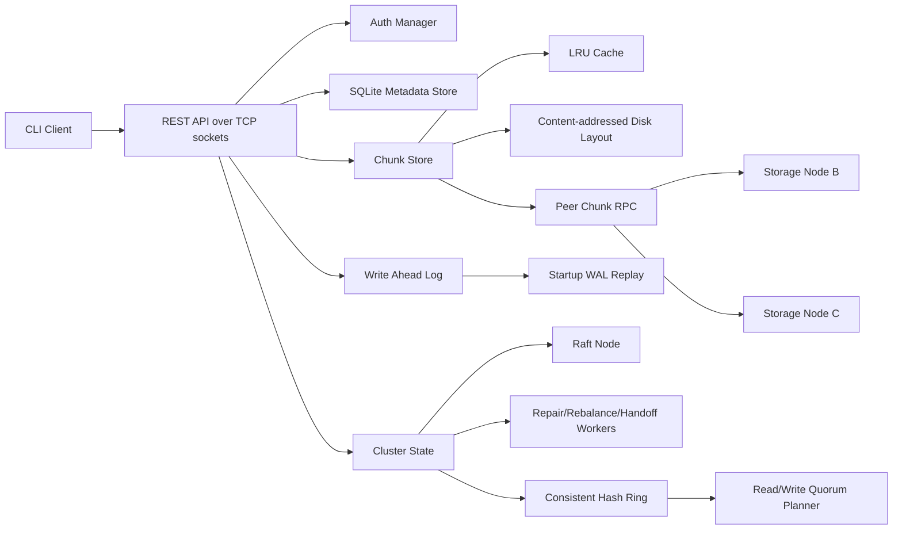

# Architecture

The system is split into a metadata plane and a storage plane.

## Write Path

1. Client sends `PUT /v1/objects/{bucket}/{key}` with a bearer token.
2. Server authorizes write permission.
3. Object bytes are chunked into fixed-size chunks.
4. The mutation intent is appended to the WAL.
5. Every chunk is SHA-256 hashed and written under `chunks/<prefix>/<checksum>`.
6. Existing chunks are reused for deduplication.
7. The consistent hash ring chooses replica targets.
8. The node client sends chunk replicas to peer nodes over TCP/REST.
9. The write succeeds only after the configured write quorum acknowledges.
10. Metadata is committed transactionally into SQLite.

## Read Path

1. Client sends `GET /v1/objects/{bucket}/{key}`.
2. Metadata returns the ordered chunk list.
3. The read plan selects healthy replicas.
4. The server reads from local or peer replicas until read quorum succeeds.
5. If a replica is missing or stale, read repair rewrites the verified chunk to that replica.
6. Chunks are loaded from cache or disk and verified.
7. The final object checksum is verified.

## Failure Handling

Nodes publish heartbeats to the cluster state. Placement excludes stale nodes. Failed writes to unavailable replicas are recorded as hinted handoff entries. When the node returns, the handoff queue replays missing chunks. Replica recovery and rebalancing recompute desired placement from consistent hashing, then rewrite healthy chunks through the distributed chunk service. Startup WAL replay validates durable mutation records before the node accepts traffic.

## Consensus

The Raft module implements follower/candidate/leader roles, voting, log freshness checks, append entries validation, client command acceptance on the leader, leader next-index and match-index tracking, follower acknowledgements, and majority commit advancement.
