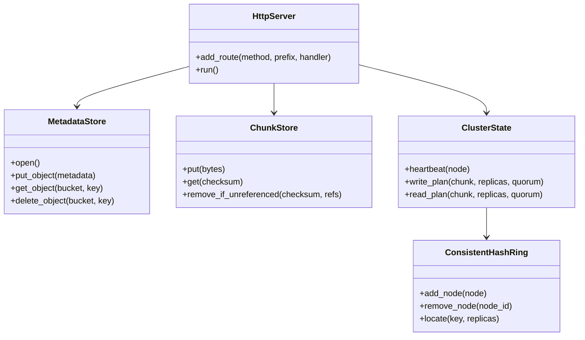

# UML

```mermaid
classDiagram
  class HttpServer {
    +add_route(method, prefix, handler)
    +run()
  }
  class MetadataStore {
    +open()
    +put_object(metadata)
    +get_object(bucket, key)
    +delete_object(bucket, key)
  }
  class ChunkStore {
    +put(bytes)
    +get(checksum)
    +remove_if_unreferenced(checksum, refs)
  }
  class ClusterState {
    +heartbeat(node)
    +write_plan(chunk, replicas, quorum)
    +read_plan(chunk, replicas, quorum)
  }
  class ConsistentHashRing {
    +add_node(node)
    +remove_node(node_id)
    +locate(key, replicas)
  }
  HttpServer --> MetadataStore
  HttpServer --> ChunkStore
  HttpServer --> ClusterState
  ClusterState --> ConsistentHashRing
```
